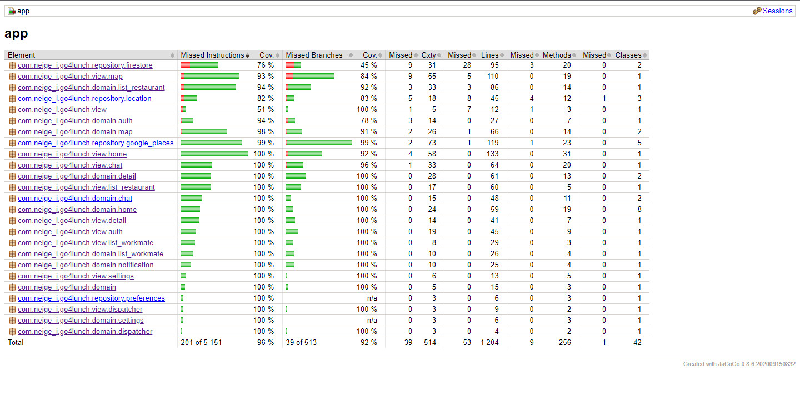
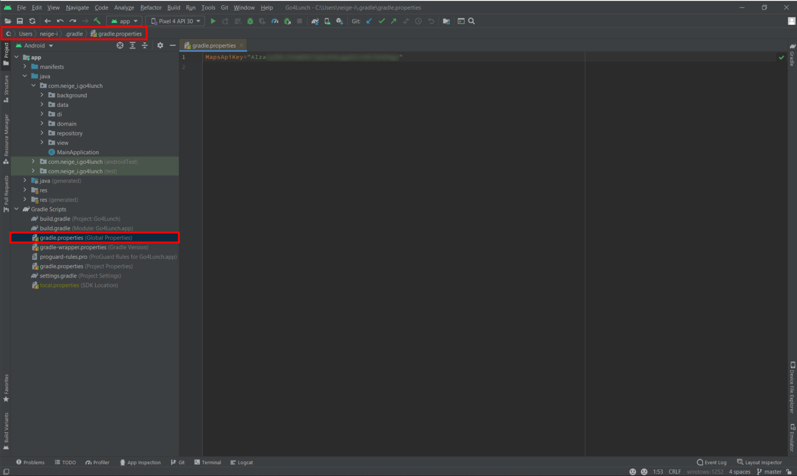

# P7 - Go4Lunch

## Code coverage

Here is the screenshot of the code coverage report made by JaCoCo:  

## Maps API key
This app makes requests to the Google Places API.
So, to correctly displays Google Maps related information, you should provide your own Maps API key.

### How to provide a key with Gradle and keep it private?

  
In Android Studio, under "Gradle Scripts" inside the "Project" tool window,
you should find a file named ``gradle.properties``.  
If you don't, create the file on your own disk at the following path:
- ``C:\Users\<you>\.gradle\`` on Windows
- ``/Users/<you>/.gradle/`` on Mac and Linux

> Notice the file is **outside of the project workspace** to prevent Git from versioning it and
> thus making it public.

Finally, add a new variable in the ``gradle.properties`` file.
Name it ``MapsApiKey`` and assign it the value of your Maps API key.
If you don't own an API key yet, you can create it in the Google Cloud Platform console,
under the [APIs and services/Credentials](https://console.cloud.google.com/apis/credentials) menu.
